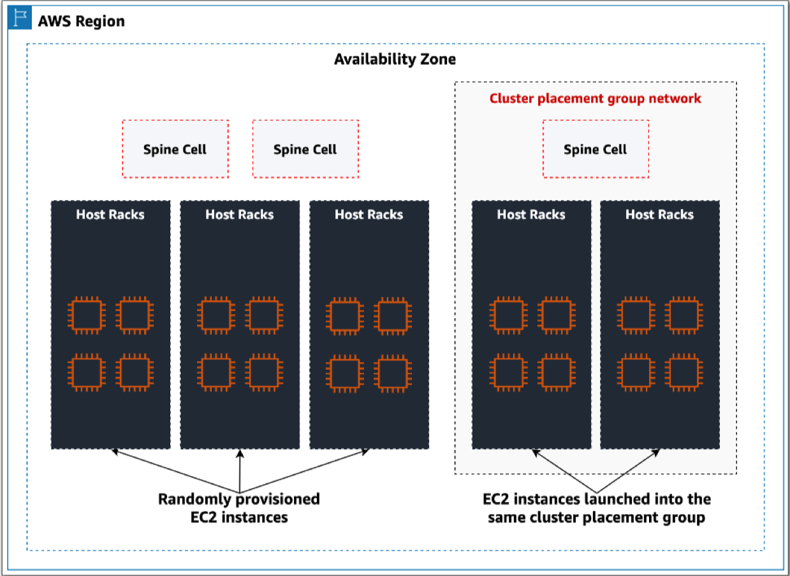

[Crypto market-making latency and Amazon EC2 shared placement groups](https://aws.amazon.com/blogs/industries/crypto-market-making-latency-and-amazon-ec2-shared-placement-groups/)

# Terminology Explanation

**EC2**

Amazon Elastic Compute Cloud

**AWS Region**

Each *AWS Region* is a separate geographic area. Each AWS Region has multiple, isolated locations known as *Availability Zones*.AWS often has multiple regions in a single country.

**Availability Zone**

An Availability Zone is one or more discrete data centers. When you create a DB instance, you can choose an AZ or have Amazon RDS choose randomly. Random selection by RDS doesn't guarantee an even distribution of DB instances among Availability Zones.

**Host Rack**

It actually contains physical servers. Every rack has its own power source and its own network infrastructure.

**Partition placement groups**

It's an EC2 feature. It allows you to get groups of two instances(partitions) and ensure that all of the EC2 instances in a given partition group do not share any physical racks with those instances of the other partition groups.

**Access Cell**

It's a container of network of routers that connect with host racks machines. Keep adding access cell is a way to scale.

## Levels of Building Blocks

- [Placement Group Network](https://www.youtube.com/watch?v=UObQZ3R9_4c&t=896s)
  - Spine cell
  - Access cell
    - Router 1
    - Router 2
    - ... (routers are connected)
  - Host Racks
    - Machine 1
    - Machine 2
    - ... (machine coulbe be placed in parition placement groups or separate groups)
  - Racks and access cells are connected (like a parse nn)

# Processes

To reduce the latency between company's servers and exchange's servers, we want to use Amazon EC2 shared CPGs to reduce the distance between the them. Amazon EC2 placement groups are a feature provided by Amazon EC2 that allows customers to control the placement of instances across the underlying hardware within an availability Zone. 

## How does it work

CPG provide a placement strategy that allows EC2 instances to share connectivity to the same spine cell to reduce latency of network.

Before October 2022, placement groups couldn't be shared between AWS accounts. Since our company and the exchange company are using different accounts, it cannot help. Now, different accounts could share the same spine cell.

However, our company should do the testing before we ask the exchange to share their EC2 cluster placement groups with us.

CPGs are designed to make sure of the physical network proximity thus, they don't span AZs.

## Measurement Metrics

- Network latency
- Packet processing rates

## VPC Peering

Customers must estabilish and allow logical network connectivity between their instances. For instances within the same VPN, this is easily achieved by updating seciruty groups. However, in the MM and Exchange case, there is a need to configure additional inter-VPC networking connectivity.

Need to use Amazon VPN Peering to achieve logical connectivity.

==Is it possible to connect to exchange servers using private network?==

## AWS PrivateLink

Your VPC -> Elastic Network Internface -> Network Load Balancer -> 3rd party VPC, using AWS Private Link.